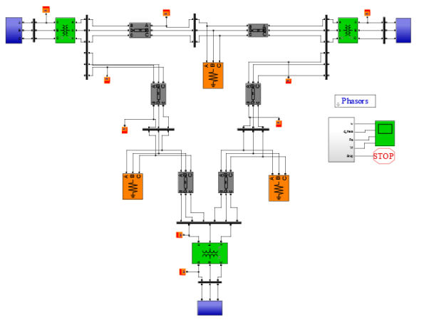

# Fault-Classification-in-power-systems

IEEE_9bus_new_o.slx is the Simulink model used for generating data. After a fault happens, 10 readings at a frequency of 1kHz is taken. code.py predics the fault class using different techniques.

Data Generation – 
For generation of fault data, IEEE 9-bus system was used. 

First of all, a fault between phase A and ground was created. Then, post fault values of current and voltage are taken into consideration. The values of their fourier transforms are fed into a positive sequence analyser. 

Upon analysis of current and voltage magnitudes and angles, it was found out that voltage magnitude values would be most optimal for predicting fault location.

Various graphs are shown as following – 
Positive sequence value of voltage

3-phase values of fourier transform of voltage

All sequence values of current

Various different reading were taken by varying the distance of fault. A total of 1225 reading were taken and the range of fault location was set to be in [0 km, 100 km].

Applying Machine Learning for Regression– 

The first 10 values of positive sequence magnitude of voltage phasor clocked at 1kHz have been taken into consideration for predicting the fault location.  
Support Vector Regression
Support Vector Machines are supervised learning models with associated learning algorithms that analyse data used for classification and regression analysis. 

Accuracy – 91.66007

K-Nearest Neighbors
K-nearest neighbors algorithm (k-NN) is a non-parametric method used for classification and regression.[1] In both cases, the input consists of the k closest training examples in the feature space. In k-NN regression, the output is the property value for the object. This value is the average of the values of k nearest neighbors.
For hyperparameter optimization, the value of K was varied and the following graph was obtained.

Accuracy – 95.12041

Artificial Neural Network
In ANN, 10 nodes at input layer are present. Each of them takes a different value of positive sequence magnitude of voltage phasor. 
Hyperparameter tuning was done by varying the number of hidden layers and nodes in each one of them and then predicting the fault location.
Accuracy – 96.80401

LSTM(Long Short Term Memory)
LSTMs can almost seamlessly model problems with multiple input variables. All we need is a 3D input vector that needs to be fed into the input shape of the LSTM. LSTM’s have shown exceptional results in time series forecasting, where classical linear methods can be difficult to adapt to multivariate or multiple input forecasting problems.
Accuracy - 93.42841

